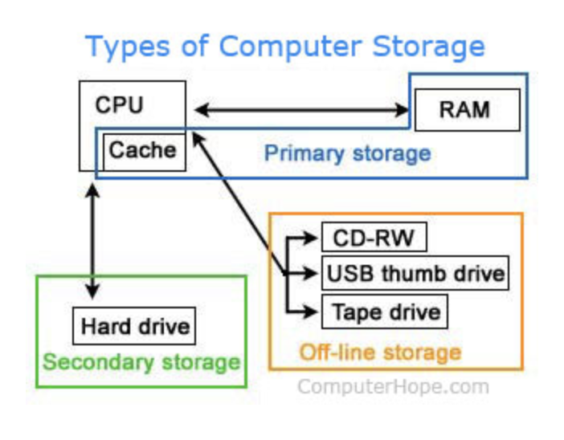
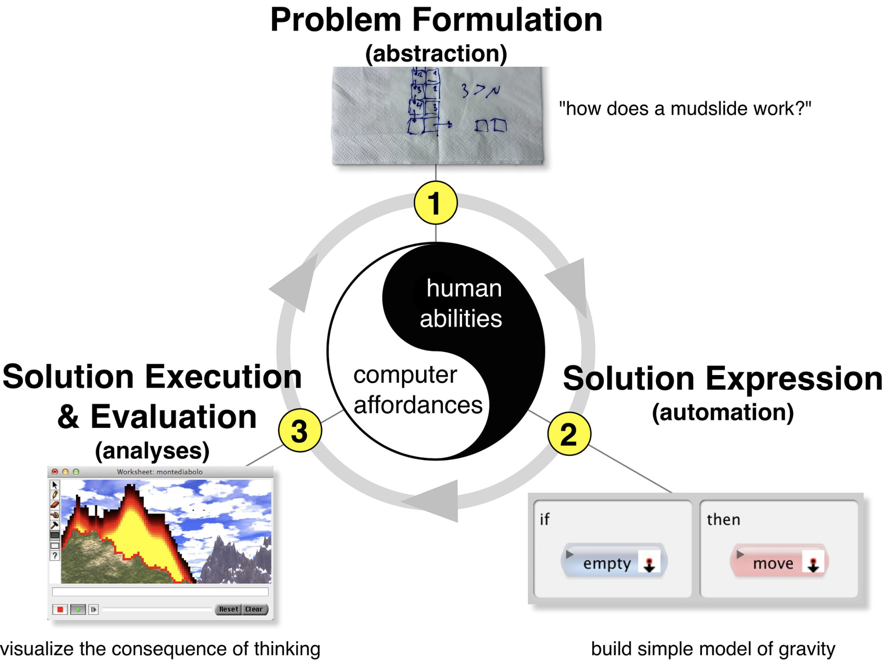
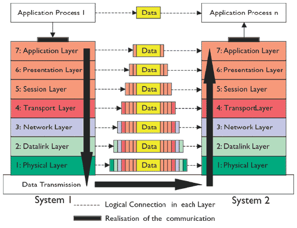
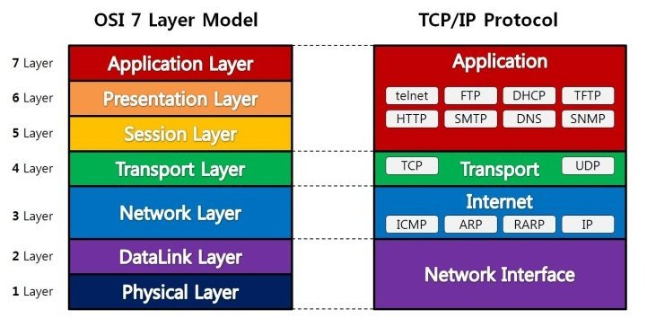
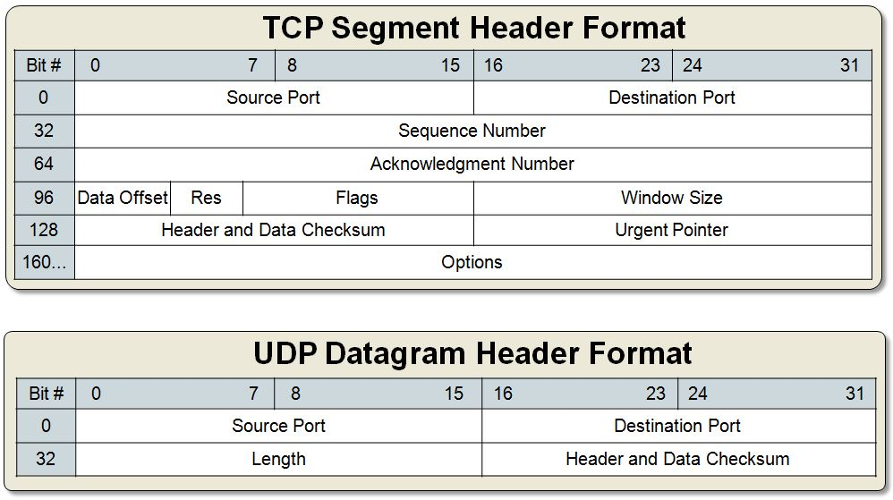

# computer Science

---

## What is Computer Science
> Study of Computer and computational systems something like software and software systems
---

## Computer
> Compute + er  
    Compute : Not only implies a strictly arithmetic process but aslo applies rules in a systematic way 

    Cf. calculation : just arithmetic calculate and can't store impormation
---

## Basic Computer Architecture


* Control Unit : contains the address (location) of the instruction being executed at the current time
* Arithmetic Logic Unit : `+, -, *, /, AND, OR, NOT `
---

## CPU(Central Processing Unit)
> CPU is handles all instructions it receives from hardware and software running on the computer
---

## Memory
> Memory is physical device capable of storing information temporarily or permanently



* Primary Storage
    * RAM(Random Access Memory)
        * RAM is hardware device that allows information to be stored and retrieved on a computer
        * when computer is turnning on, RAM is working
    * Cache Memory
        *Cache Memory is high-speed access area that can be a reserved section of main memory or on a storage device
---

## OS(Oerating System)
> OS is manages computer hardware and software resourse and provides common services for computer programs.

---

## Type of OS
* Unix
    * Straing in the 1970s by AT&T
    * Made by Thompson, Denis Ritchie and others

        Cf. Unix-like : Solaris, BSD, MacOs ...

* Linux
    * Unix-clone OS
    1991.9.17 made by Linus Torvalds
    
        Cf. Linux-like : Android, Tizen, Chrome Os

* Window
    * History of Window
        * CP/M-DOS --> MS-DOS
        * Windows 1
        * Windows 3.1
        * Windows 95
        * Windows XP
        * Windows Vista
        * Windows 7
        * Windows 8
        * WinDows 10
---

# Computational Thinking
> Computational Thinking is Process of generalization of Problem that hasn't correct answer
---

## Process of Computational Thinking
* Problem formulation (abstraction)  
* Solution expression (automation)  
* Solution execution and evaluation (analyses)  


---

# Pseudocode
> Pseudocode is present computer program or algorithm as a language to understand human 
---

## Merit of Pseudocode
* Design a program it works as a rough sketch
* Esay to code modify and divide
* Role of comment
---

## How to Write Pseudocode
> It doesn't have rule (it on you)
---

# Algorithm
> Algorithm is a series of contained steps which you follow in order to achieve some goal, or to produce some output
---

## Algorithm Conditions
* Clarity
* Has external input
* Has one or more result
* Finite trial
* Simplicity
---

## Clarity
* Time complexity == big O notation
    > Change of time pattern as data increase

* Type of big O notation
    * 1
    * log n  
    * n  
    * n log n  
    * n^2  
    * n^3  
    * 2^n  
    * n!
---

## Sort Algorithm
* O(n^2)
	* [Bubble sort](https://www.youtube.com/watch?time_continue=52&v=nmhjrI-aW5o)  
       * Works by repeatedly swapping the adjacent elements if they are in wrong order
	* [Selection sort](https://www.youtube.com/watch?time_continue=76&v=xWBP4lzkoyM)  
        * An array by repeatedly finding the minimum element (considering ascending order) from unsorted part and putting it at the beginning
	* [Insertion sort](https://www.youtube.com/watch?v=OGzPmgsI-pQ)  
        * Builds the final sorted array (or list) one item at a time
* O(n log n)
	* [Merge sort](https://www.youtube.com/watch?v=JSceec-wEyw)  
        * Divides input array in two halves, calls itself for the two halves and then merges the two sorted halves
	* [Heap sort](https://www.youtube.com/watch?v=JSceec-wEyw)  
        * A comparison based sorting technique based on Binary Heap data structure
	* [Quick sort](https://www.youtube.com/watch?v=PgBzjlCcFvc)  
        * It picks an element as pivot and partitions the given array around the picked pivot
---

# Data Structure
* Data structure is a particular way of organizing data in a computer so that it can be used efficiently
---

## Data Structure in Web Development

* Stack
    * stack is an abstract data type that serves as a collection of elements, with two principal operations  

        
    > LIFO [Last in, First out]  
* Queue
    * queue is a particular kind of abstract data type or collection in which the entities in the collection are kept in order  

          
        > FIFO [First in, First out]
---

# Kernel
 > Kernel is software that connect the hardware and application  

 
 ---

 # Shell
 > Shell is sofrtware that connect user and Kernel
 ---

 ## Type of Shell
 * Sh(Bource Shell) : Steve Bourne who work in AT&t makes Unix shell  
 * Csh : Bill Joy makes Unix shell (looks like C language)  
 * Bash(Bourne Agian Shell) : Brian Fox makes Unix shell
 * Zsh : Paul Falstad makes Unix shell (Extension of Sh)
 ---

 # Git
 * One of the VSC(Version Control System)
 * Linus Torvalds makes the Git  
    [git official repo](https://github.com/git/git)
 ---
## Characteristics of Git
* Fast speed and simple structure
* Distributed storage support
* Non-Linear Development support
---

## Git Object
* Blob : unit of file
* Tree : collection of Blob
* commit : imformation of file
---

## Git Process and Command

  
---

## Git Branch
* Make a point of divergence and modify code independently
---

## Git Flow Strategy

---

# Network
> A computer network or data network is a telecommunications network which allows nodes to share resources
---

## characteristics of Network
* Share resources between computer
* Access other computer and file can be created, modified, delected
* An output device can be access with computers 
---

## Requirements of Network

* Network cable
* Distributor(Switch Hub)
* Router
* Network card
---

## Network Scope
* LAN
    * Local Area Network
    * school, office...
* WLAN
    * Wireless Local Area Network
    * school, office ...
    * IEEE 802.11
* MAN
    * Metropolitan Area Network
    * city ...
* WAN
    * Wide Area Network
    * nation, continent ...
---

## Another Way of Networking
* Lifi(Light Fidelity) (IEEE 802.15.7r1)
* Power Line Networking (IEEE 1901)
---

## Network Topology


---

## Packet
* Network packet is a formatted unit of data carried by a packet-switched network
* 1492 ~ 1500 bytes
* in network, use octet(unit) instead of byte(unit)

## Network OSI7 layer
* `O`pne `S`ystems `I`nterconnection Reference Model



---
## Application Layer
* User interact directly with the software application
* not application
---

## Presentation Layer
* Presentation layer transforms data into the form that the application accepts
---

## Session Layer
* Session layer controls the dialogues (connections) between computers.
* Manages and terminates the connections between the local and remote application.
---

## Transport Layer
* Transport layer also provides the acknowledgement of the successful data transmission and sends the next data if no errors occurred
* Creates packets out of the message received from the application layer
---

## Network Layer
* Network layer provides the functional and procedural means of transferring variable length data sequences from one node to another connected in different networks
* Router is in here
---

## Datalink Layer
* Data link layer provides node to node data transfer
* Switch is in here
---

## Physical Layer
* The physical layer defines the electrical and physical specifications of the data connection
---

## TCP/IP Protocal

* Application : What's data will be send
* Transport : How to send
* Internet : How to distingush me or the others
---
### Applicaiton
* HTTP
    * HyperText Transfer Protocol
    * HTTP method: `GET, POST, PUT, DELETE`
* FTP
    * File Transfer Protocol
    * Vulnerable to security
    * Thesedays, uses FTPS(FTP-SSL), SFTP(simple FTP), SSH(Secure SHell) ...
* SMTP
    * Simple Mail Transfer Protocol
---
### Transport
* TCP
    * Transmission(Transfer) Control Protocol
    * Provides reliable, ordered, and error-checked delivery of a `stream` of octets between applications running on hosts communicating by an IP network
* UDP
    * User(Universal) Datagram Protocol
    * Referred to as `datagrams`, to other hosts on an IP network.  

    Cf.  
    Stream : An internal endpoint for sending or receiving data at a single node in a computer network
    Datagram : Datagrams provide a connectionless communication service across a packet-switched network  

    

---

## IP
* IPv4
    * Internet Protocol version 4
    * 32 bit
    * `2^32`=`42.9*10^8`
* IPv6
    * Internet Protocol version 6
    * 128 bit
    * `2^128`=`16*16*16*16*16*16^8`=`340,282,366,920,938,463,463,374,607,431,768,211,456`=`3.4*10^38`
 ---

 ## DNS
 * Domain Name System
 * A hierarchical decentralized naming system for computers, services, or other resources connected to the Internet or a private network
---
---

* Refer to
    * https://undergrad.cs.umd.edu/what-computer-science
    * https://www.computerhope.com/jargon/c/cpu.htm
    * https://www.computerhope.com/jargon/m/memory.htm
    * https://en.wikipedia.org/wiki/Computational_thinking
    * https://www.geeksforgeeks.org/
    * https://www.computerhope.com/issues/ch001559.htm
    * https://en.wikipedia.org/wiki/OSI_model
    * https://en.wikipedia.org/wiki/Transmission_Control_Protocol
    * https://en.wikipedia.org/wiki/User_Datagram_Protocol
---
# Web Programming 
 >  Refer to the writing, markup and coding involved in Web development, which includes Web content, Web client and server scripting and network security
---
## Change in Web Programmin patterns

1. 1991 ~1991 : Development of Web technology based on static content after Sir Tim Berners Lee suggesting Hyper Text

```html
<html>
<head></head>
<body>
<h1>Static Header</h1>
<div>Static Contents</div>
</body>
</html>
```  

2. 1999~2009 : Dynamic server as Linux, Apache, Mysql, Php and static Client model persistent
```html
<html>
<head></head>
<body>
<h1></h1>
<div></div>
</body>
</html>
```  

3. 2010 ~ : javaScript
```html
<html>
<head>
<script src="https://unpkg.com/vue"></script>
</head>
<body>
<h1>{{ header }}</h1>
<div id="app">
  {{ message }}
</div>
<script>
var app = new Vue({
  el: '#app',
  data: {
    message: '안녕하세요 Vue!'
  }
})
</script>
</body>
</html>
```
---

Web Browser
* Mosaic (1993)
* Netscape(1994)
* Internet Explorer(1995)
* FireFox (2004)
* Chrome(2008)
---

## Present of Web programming
* Client-side
    * HTML/CSS, javaScript
    * jQuery, AJAX
    * Front-end Web Framework
        * AngularJS
        * React.js
        * Vue.js
    * CSS Framework
        * Bootstrap
        * Foundation  

* Server-side
    * Depends on Language
        * PHP: Laravel
        * javaScript: Node.js(Express.js)
        * Java: Spring
        * C++, C#: ASP.net
        * Python: Django, Flask
        * Golang: itself
        * Ruby: Ruby on Rails

* Database
    * RDBMS(Relational database management system)
        * MySQL
        * PostgreSQL
        * MariaDB
    * noSQL
        * MongoDB
        * CouchDB
        * Redis
---

## URI, URL, URN

* URI
    * Uniform Resource Information
    *  `https://www.example.com/post/how-to-make-url`  

* URL 
    * Uniform Resource Locator
    * `https://www.example.com/post/`

* URN 
    * Uniform Resource Name
    * `www.example.com/post/how-to-make-url`  
---

## API
* Application Program Interface
---

## Web API
* Web API is an API for either a web server or a web browser
---

## REST API
* `RE`presentational `S`tate `T`ransfer 
Application Programming Interface
* HTTP URI + HTTP method 

    * Cf. HTTP Response Code  

        200, 201 - Success  
        400, 404 - Not found  
        403 - Forbidden  
        500 - Server error  

        |HTTP||REST|Status Code|
        |:--:|:--:|:--:|:--:|
        |GET||read|200 OK|
        |POST||create|201 CREATED|
        |PUT||update|200 OK|
        |DELETE||delete|200 OK|

        404 Not Found  
        500 Internal Server Error
---

## Characteristics of REST
* General application
* Resource centric
* Statesless
---

## RESTful API Documentation
* Use the method that be defined already
* Write it in a user defined way
* Don't highlight the URI
* Don't trust documentation tool


